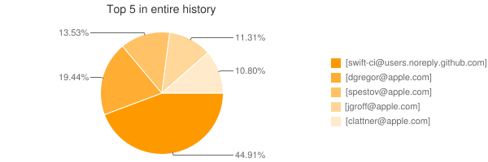

# git-stats

## Build docker image
```shell script
docker build -t alpine/git-stats:1.0 .
docker run -it --rm -v ${local_git_repos}:/repos alpine/git-stats:1.0 /apps/git-stats/scripts/start.sh
```

## Supported features
* list contributors with the highest number of commits in last month, year, entire repo history
* list contributors with the highest number of changes in last month, year
* list number of commits in last month, year, entire repo history
* list number of commits per tag which follow pattern
* list number of tags in last month, year, entire repo history
* export results to csv file
* export results to png file as pie chart

## Examples
* An example of number of commits done in `apple/swift` repo aggregated by year in csv file
```
YYYY,#commits
2018,19010
2017,17964
2019,16785
2016,15018
2020,14652
2015,11281
2014,10297
2013,6427
2012,2249
2021,786
2011,697
2010,209
```
* An example of top 5 contributors with the highest number of commits in `apple/swift` repo
